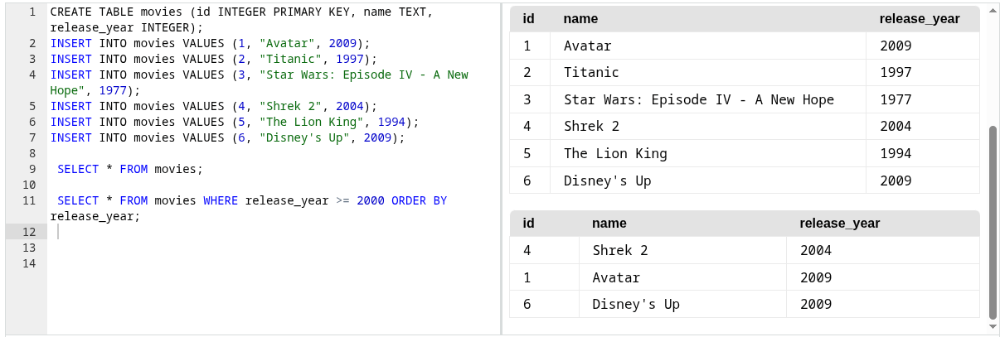
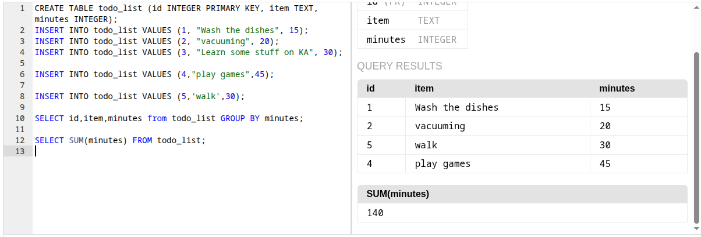
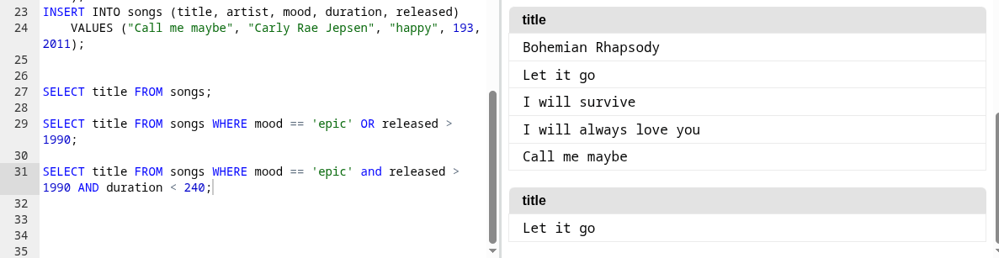
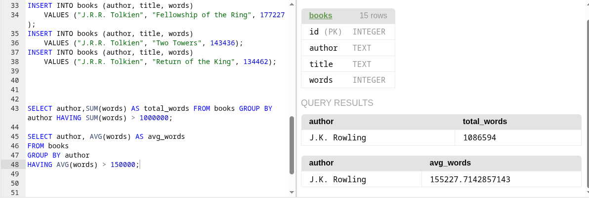
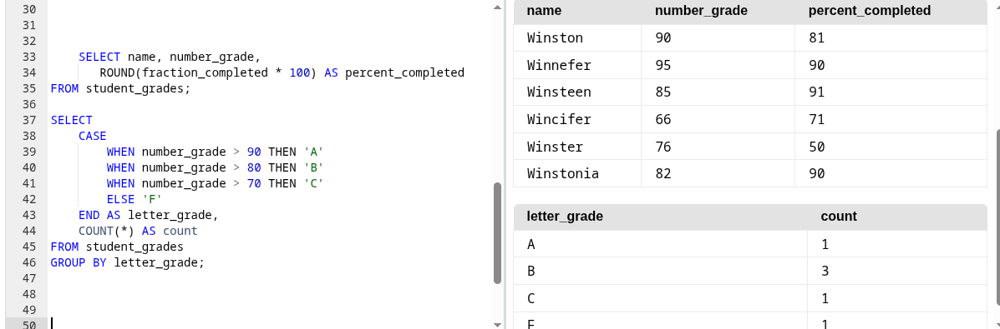

# SQL — ściągawka

## 0. Typy danych

| Typ | Znaczenie |
|---|---|
| `TEXT` | tekst |
| `INTEGER` | liczba całkowita |
| `REAL` / `FLOAT` | liczba z przecinkiem |
| `BOOLEAN` | TRUE / FALSE |
| `DATE` | data |
| `DATETIME` | data i czas |

---

## 1. Tworzenie tabeli

```sql
CREATE TABLE nazwa_tabeli ( nazwa_kolumny typ_danych, nazwa_kolumny typ_danych, ... );
```
tworzy nową tabelę

```sql
id INTEGER GENERATED ALWAYS AS IDENTITY PRIMARY KEY
```
klucz główny z automatycznie nadawanym numerem

---

## 2. Dodawanie danych

```sql
INSERT INTO nazwa_tabeli VALUES (..., ..., ...);
```
dodaje nowy rekord (wartości dla wszystkich kolumn, po kolei)

```sql
INSERT INTO nazwa_tabeli (kolumna1, kolumna2) VALUES (..., ...);
```
dodaje rekord, podając wartości tylko dla wybranych kolumn

---

## 3. Wyświetlanie danych

```sql
SELECT * FROM nazwa_tabeli;
```
wyświetla całą tabelę

```sql
SELECT nazwa_kolumny FROM nazwa_tabeli;
```
wyświetla wybraną kolumnę

```sql
SELECT * FROM nazwa_tabeli WHERE wartość > 2000 ORDER BY nazwa_kolumny;
```
wyświetla rekordy spełniające warunek i sortuje je rosnąco (malejąco → `ORDER BY nazwa_kolumny DESC`)



---

## 4. Grupowanie

```sql
SELECT nazwa_kolumny, inna_nazwa_kolumny FROM nazwa_tabeli GROUP BY nazwa_kolumny;
```
grupuje wiersze po wartościach `nazwa_kolumny` — używa się głównie z funkcjami typu `SUM`, `COUNT` (kolejność wyniku ustawia się przez `ORDER BY`, malejąco → `DESC`)



---

## 5. Funkcje agregujące

```sql
SELECT SUM(nazwa_kolumny) FROM nazwa_tabeli;
```
sumuje wszystkie wartości z danej kolumny

```sql
SELECT COUNT(nazwa_kolumny) FROM nazwa_tabeli;
```
liczy liczbę wierszy (rekordów)

```sql
SELECT AVG(nazwa_kolumny) FROM nazwa_tabeli;
```
liczy średnią wartość z danej kolumny

```sql
SELECT MIN(nazwa_kolumny) FROM nazwa_tabeli;
```
zwraca najmniejszą wartość z danej kolumny

```sql
SELECT MAX(nazwa_kolumny) FROM nazwa_tabeli;
```
zwraca największą wartość z danej kolumny

---

## 6. Operatory logiczne (AND, OR, IN)

```sql
SELECT title FROM songs WHERE mood = 'epic' OR released > 1990;
```
wyświetla wiersze spełniające **przynajmniej jeden** z warunków

```sql
SELECT title FROM songs WHERE mood = 'epic' AND released > 1990 AND duration < 240;
```
wyświetla wiersze spełniające **wszystkie** warunki naraz (można łączyć dowolną liczbę warunków przez `AND`)

```sql
SELECT title, artist FROM songs WHERE artist IN (SELECT name FROM artists WHERE genre = 'Pop');
```
`IN` sprawdza, czy wartość znajduje się na liście — lista może być podana ręcznie (`IN ('a', 'b')`) albo pochodzić z podzapytania (`SELECT ...`) jak wyżej



---

## 7. HAVING

```sql
SELECT type, SUM(calories) AS total_calories FROM exercise_logs
    GROUP BY type
    HAVING total_calories > 150;
```
filtruje **wyniki po zgrupowaniu** (na wartościach z funkcji agregujących typu `SUM`, `AVG`) — `WHERE` tego nie potrafi, bo działa przed grupowaniem

```sql
SELECT type, AVG(calories) AS avg_calories FROM exercise_logs
    GROUP BY type
    HAVING avg_calories > 70;
```
to samo, tylko warunek na średniej zamiast sumy

```sql
SELECT type FROM exercise_logs GROUP BY type HAVING COUNT(*) >= 2;
```
`HAVING` można łączyć też z `COUNT` — tu: pokazuje tylko typy występujące co najmniej 2 razy

```sql
SELECT author, SUM(words) AS total_words FROM books GROUP BY author HAVING SUM(words) > 1000000;
```
w `HAVING` warunek można podać wprost na funkcji agregującej (`SUM(words) > ...`), nie tylko przez alias (`total_words > ...`) — działa tak samo



---

## 8. ROUND

```sql
SELECT name, ROUND(fraction_completed * 100) AS percent_completed FROM student_grades;
```
zaokrągla wynik obliczenia do liczby całkowitej (przydatne np. przy liczeniu procentów)

---

## 9. CASE

```sql
SELECT name,
    CASE
        WHEN number_grade > 90 THEN 'A'
        WHEN number_grade > 80 THEN 'B'
        WHEN number_grade > 70 THEN 'C'
        ELSE 'F'
    END AS letter_grade
FROM student_grades;
```
`CASE` sprawdza warunki po kolei (`WHEN ... THEN ...`) i zwraca wartość przypisaną do pierwszego spełnionego — jeśli żaden nie pasuje, zwraca wartość z `ELSE`. Działa jak `if/else` wewnątrz `SELECT`, wynik można nazwać aliasem (`AS letter_grade`)

Można łączyć z `GROUP BY`, żeby policzyć, ile wierszy wpadło do każdej kategorii:
```sql
SELECT
    CASE
        WHEN number_grade > 90 THEN 'A'
        WHEN number_grade > 80 THEN 'B'
        WHEN number_grade > 70 THEN 'C'
        ELSE 'F'
    END AS letter_grade,
    COUNT(*) AS count
FROM student_grades
GROUP BY letter_grade;
```


